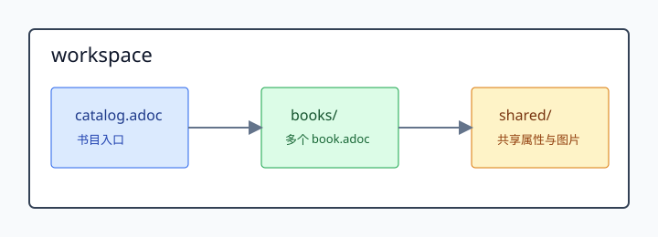

= AsciiDoc 多书工作区
作者 <author@example.com>
v0.1, 2026-05
:toc: left
:toclevels: 2
:icons: font
:experimental:
:idprefix:
:idseparator: -

本页是样本书导航。每本书代表一种常见书籍组织场景。

== 按目标选择

[cols="1,2,3", options="header"]
|===
|如果你想... |先看 |原因

|认识一本完整 AsciiDoc book 的结构位置
|xref:books/00-book-anatomy/book.adoc[00 完整书籍结构标本]
|它集中展示前置、正文、分部和后置结构。

|复制一个普通单书起点
|xref:books/01-starter-book/book.adoc[01 日常独立单书]
|它保持最常用、最少负担的 book 结构。

|在同一本书里组织第一部、第二部
|xref:books/02-multipart-monograph/book.adoc[02 长书分部]
|它展示 book doctype 下的 part 与 partintro。

|写带代码、图表、共享资源的技术书
|xref:books/03-technical-book-workflow/book.adoc[03 技术书工作流]
|它展示资源边界、图表和构建检查。

|查结构选择、术语和写法模式
|xref:books/04-reference-manual/book.adoc[04 参考手册]
|它是查阅型书，而不是线性教程。

|组织可独立发布的上册
|xref:books/05-upper-volume/book.adoc[05 上册]
|它展示分卷上册作为独立 book 的入口。

|组织可独立发布的下册
|xref:books/06-lower-volume/book.adoc[06 下册]
|它用文本示例说明跨卷引用写法，但不真实依赖上册。

|让源书稿保持可读，同时保留可被工具链读取的结构关系
|xref:books/07-structured-writing-conventions/book.adoc[07 结构化书写约定标本]
|它展示标题、稳定 ID、role、xref、rel 和附加字段如何形成结构化书稿表面。
|===

== 样本书

* xref:books/00-book-anatomy/book.adoc[00 完整书籍结构标本]：覆盖 book 的前置、正文、分部和后置结构。
* xref:books/01-starter-book/book.adoc[01 日常独立单书]：新增普通 book 的复制起点。
* xref:books/02-multipart-monograph/book.adoc[02 长书分部]：同一本 book 内部的 part 结构。
* xref:books/03-technical-book-workflow/book.adoc[03 技术书工作流]：图表、代码片段和资源边界。
* xref:books/04-reference-manual/book.adoc[04 参考手册]：结构选择、路径规则和引用模式。
* xref:books/05-upper-volume/book.adoc[05 上册]：独立分卷的上册。
* xref:books/06-lower-volume/book.adoc[06 下册]：独立分卷的下册，并用示例说明跨卷引用写法。
* xref:books/07-structured-writing-conventions/book.adoc[07 结构化书写约定标本]：标题、稳定 ID、role、xref、rel 和附加字段的结构化写法。

== 工作区地图

== 书籍边界速判

* 只是同一本书内部的第一部、第二部：看 xref:books/02-multipart-monograph/book.adoc[02 长书分部]。
* 上册需要独立入口和独立构建：看 xref:books/05-upper-volume/book.adoc[05 上册]。
* 下册需要说明跨卷引用写法但不制造默认依赖：看 xref:books/06-lower-volume/book.adoc[06 下册]。
* 新增一本普通书：从 xref:books/01-starter-book/book.adoc[01 日常独立单书] 开始。
* 查路径、引用和增长规则：看 xref:books/04-reference-manual/book.adoc[04 参考手册]。
* 写需要被读者和工具同时理解的结构化源文本：看 xref:books/07-structured-writing-conventions/book.adoc[07 结构化书写约定标本]。
